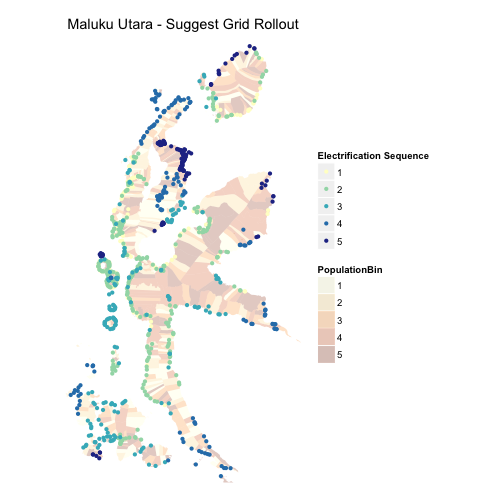
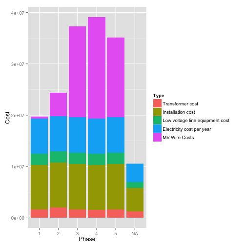

# Eastern Indonesia Energy Access Scale-up
## Analysis Around the Geospatial Planning 

========================================================

Kicked off by a January 2013 workshop, the consultant consortium working towards the Indonesia Energy Access Scale-Up Project identified several key inputs of planning level detail to develop a geospatially-based least cost electrification plan.  This effort identified essential nationally-produced input data sources to develop a well-informed plan.  Components used in this analysis include:
* 1.  BIG Land-Use Classification Maps indicating specfic settlement areas
* 2.	BPS Census information including Desa-level information on population, households and current electricity connections (dated 2010)
* 3.	PLN provided cost-data and historical consumptions rates
* 4.	PLN gathered and digitized Medium Voltage powerline data

Sample Data can be downloaded from dropbox:
https://www.dropbox.com/sh/6i6r46a3czjd244/gF_kE4gixe


```r

require(gdata)
require(plyr)
require(stringr)
require(data.table)
require(ggplot2)
require(grid)
require(maptools)
require(stats)

source("~/github/local/network-planner/IDN-analysis/PostProcessing/interpret_commonfunctions.R")

## Jonathan's directory
setwd("~/Dropbox/Indonesia Geospatial Analysis/Data Modeling and Analysis/NPoutputs/January-2014/")
### Downloads setwd('~/Downloads/IDN_Analysis_Sample_Data/')


### LOAD THAT DATA RIGHT UP###

# #Import metrics local for each island areas in the analysis #metrics local
# is the key output file of each Network Planner scenario capturing nodal
# level information
maluku <- read.csv("569-Maluku-900HHD+23pkWh/metrics-local.csv", skip = 1, stringsAsFactors = F)
# flores <- read.csv('567-FloresBarat-900HHD/metrics-local.csv',
# skip=1,stringsAsFactors=F)
malukuutara <- read.csv("564-MalukuUtara-900HHD/metrics-local.csv", stringsAsFactors = F, 
    skip = 1)
# sumba <- read.csv('563-Sumba-900HHD/metrics-local.csv',
# skip=1,stringsAsFactors=F) sumba_ranked <-
# read.csv('563-Sumba-900HHD/metrics-local-grid_with_rollout_sequence.csv',
# stringsAsFactors=F) sumba_ranked <- merge(x=sumba, y=sumba_ranked, by =
# 'Name')

# timor <- read.csv('566-Kupang-900HHD/metrics-local.csv',
# skip=1,stringsAsFactors=F) flores_timu <-
# read.csv('568-FloresTimu-900HHD/metrics-local.csv',
# skip=1,stringsAsFactors=F)


## Import proposed networks for interpeting new network, this is the NP
## minimum spanning tree Prabhas' function imports both shapefile line types
## in one go and merges them, useful...
malukuutara_path <- load.polylines("564-MalukuUtara-900HHD/")

maluku_path <- load.polylines("569-Maluku-900HHD+23pkWh/")


# maluku_proposed2 <-
# load.polylines('565-Maluku-900HHD/networks-proposed.shp') flores_proposed
# <- load.polylines('567-FloresBarat-900HHD/networks-proposed.shp')
# malukuutara_proposed <-
# load.polylines('564-MalukuUtara-900HHD/networks-proposed.shp')
# sumba_proposed <- load.polylines('563-Sumba-900HHD/networks-proposed.shp')
# timor_proposed <-
# load.polylines('566-Kupang-900HHD/networks-proposed.shp') #Import Existing
# networks for interpeting previous network maluku_existing <-
# load.polylines('565-Maluku-900HHD/networks-existing.shp') flores_existing
# <- load.polylines('567-FloresBarat-900HHD/networks-existing.shp')
# malukuutara_existing <-
# load.polylines('564-MalukuUtara-900HHD/networks-existing.shp')
# sumba_existing <- load.polylines('563-Sumba-900HHD/networks-existing.shp')
# timor_existing <-
# load.polylines('566-Kupang-900HHD/networks-existing.shp') #Import Metrics
# Gloabl stuff too,
maluku_global <- load.global(read.csv("569-Maluku-900HHD+23pkWh/metrics-global.csv", 
    stringsAsFactors = F))
# flores_global <-
# load.global(read.csv('567-FloresBarat-900HHD/metrics-global.csv',stringsAsFactors=F))
malukuutara_global <- load.global(read.csv("564-MalukuUtara-900HHD/metrics-global.csv", 
    stringsAsFactors = F))
# sumba_global <-
# load.global(read.csv('563-Sumba-900HHD/metrics-global.csv',stringsAsFactors=F))
# timor_global <-
# load.global(read.csv('566-Kupang-900HHD/metrics-global.csv',stringsAsFactors=F))
# flore_timu_global <-
# load.global(read.csv('568-FloresTimu-900HHD/metrics-global.csv',stringsAsFactors=F))
# #DESA POLYGONS #Now, let's incorporate some polygon shapefile polygons for
# background and references typMaluku Polygons
maluku_polygon <- readShapePoly("~/Dropbox/Indonesia Geospatial Analysis/Data Modeling and Analysis/NPinputs/Dec2013-Preprocessing/Shapefiles/Maluku_with_Census_Data_+_PLN_Areas.shp")
# now let's make it more ggplottable and keep any attribute data
maluku_polygon@data$id <- rownames(maluku_polygon@data)
maluku_polygon <- merge(maluku_polygon@data, fortify(maluku_polygon), by = "id")

# #NTT Polygons ntt_polygon <- readShapePoly('~/Dropbox/Indonesia Geospatial
# Analysis/Data Modeling and
# Analysis/NPinputs/Dec2013-Preprocessing/Shapefiles/NTT_with_Census_Data_+_PLN_Areas.shp')
# #now let's make it more ggplottable and keep any attribute data
# ntt_polygon@data$id <- rownames(ntt_polygon@data) ntt_polygon <-
# merge(ntt_polygon@data, fortify(ntt_polygon), by = 'id') #Maluku Utara
# Polygons
malukuutara_polygon <- readShapePoly("~/Dropbox/Indonesia Geospatial Analysis/Data Modeling and Analysis/NPinputs/Dec2013-Preprocessing/Shapefiles/Maluku_Utara_with_Census_Data_+_PLN_Areas.shp")
# now let's make it more ggplottable and keep any attribute data
malukuutara_polygon@data$id <- rownames(malukuutara_polygon@data)
malukuutara_polygon <- merge(malukuutara_polygon@data, fortify(malukuutara_polygon), 
    by = "id")


### ~~~~~~~~~~~~~~DATA LOADED!~~~~~~~~~~~~~~~~~~~~~~~####
```


# Plotting Maps

There are some useful maps we commonly generate.  Let's try to automate and streamline that here. 


```r


## Maluku Utara - all bells and whistles.  This is a comprehensive plot of
## information for which we can subtract/add more information in the future.
## Thanks @prabhasp!

# First, define more useful population catgories for Maluku Utara
mu_PopulationBins <- (quantile(malukuutara_polygon$population, probs = c(0.2, 
    0.4, 0.6, 0.8, 1), na.rm = T))

malukuutara_polygon$PopulationBin <- cut(malukuutara_polygon$population, c(0, 
    mu_PopulationBins), include.lowest = TRUE)
levels(malukuutara_polygon$PopulationBin) <- c("1", "2", "3", "4", "5")

# Also, define more useful population catgories for Maluku
m_PopulationBins <- (quantile(maluku_polygon$population, probs = c(0.2, 0.4, 
    0.6, 0.8, 1), na.rm = T))

maluku_polygon$PopulationBin <- cut(maluku_polygon$population, c(0, m_PopulationBins), 
    include.lowest = TRUE)
levels(maluku_polygon$PopulationBin) <- c("1", "2", "3", "4", "5")


# and the plot with multi-level data identified in a 'generic' function
comprehensive_plot <- function(polygon, path, points) {
    
    ggplot() + geom_polygon(data = polygon, aes(x = long, y = lat, group = group, 
        fill = PopulationBin), alpha = 0.5) + scale_fill_brewer(type = "seq", 
        palette = "YlOrBr") + geom_path(data = path, aes(x = long, y = lat, 
        group = group, linetype = MVLineType), color = "black") + scale_size_manual(values = c(0.5, 
        1.5)) + scale_linetype_manual(values = c("solid", "dotdash")) + geom_point(data = points, 
        aes(x = X, y = Y, colour = Metric...System, shape = Xy_source)) + scale_shape_manual(values = c(20, 
        11), labels = c("BIG", "BPS")) + scale_color_manual(values = c("#2b83ba", 
        "#d7191c", "#abdda4", "#ffffbf"), labels = c("Grid", "Mini Grid", "Off Grid", 
        "Unelectrified")) + labs(title = "NetworkPlanner Outputs", x = "Longitude", 
        y = "Latitude", color = "Electrification Tech.", shape = "Settlement Data Source") + 
        coord_equal(xlim = c(min(points$X), max(points$X)), ylim = c(min(points$Y), 
            max(points$Y)))
    
}


# Also establish a blank_theme template from Prabhas' recommendations
blank_theme <- function() {
    theme(axis.text = element_blank(), axis.ticks = element_blank(), axis.title = element_blank(), 
        panel.grid = element_blank(), panel.background = element_blank())
}

# Explicitly define the plot regions of interest based on NP outputs and BPS
# Polygon data
maluku_plot <- comprehensive_plot(maluku_polygon, maluku_path, maluku) + blank_theme()
maluuutara_plot <- comprehensive_plot(malukuutara_polygon, malukuutara_path, 
    malukuutara) + blank_theme()

# Sample Plots
malukuutara_plot
```

```
## Error: object 'malukuutara_plot' not found
```

```r
malukuutara_plot
```

```
## Error: object 'malukuutara_plot' not found
```


# Summarize NP Output Data

Here, we interpret basic consequence of the suggested network and try to express some useful metrics. 


```r


# Summarize outputs by technology type (ie Off-Grid, Mini-Grid and Grid
# systems)
malukuutara_summary <- summarize_metrics_local(malukuutara)
# maluku_summary <- summarize_metrics_local(maluku) flores_summary <-
# summarize_metrics_local(flores) sumba_summary <-
# summarize_metrics_local(sumba) timor_summary <-
# summarize_metrics_local(timor) flores_timu_summary <-
# summarize_metrics_local(flores_timu)

## Summarize Key Files

all_data_sets <- list(malukuutara_summary)  #,
# maluku_summary, flores_summary, sumba_summary, timor_summary,
# flores_timu_summary)

global_data_sets <- list(malukuutara_global)  #,
# maluku_global, flores_global, sumba_global, timor_global,
# flore_timu_global)

names <- c("malukuutara_summary-20140121")  #,
# 'maluku_summary-20140121', 'flores-barat_summary-20140121',
# 'sumba_summary-20140121', 'timor_summary-20140121',
# 'flores-timor-summart-20140121')


## Write XLS
require(WriteXLS)
```

```
## Warning: package 'WriteXLS' was built under R version 3.0.2
```

```r

for (i in 1:length(all_data_sets)) {
    local_agg <- as.data.frame(all_data_sets[i])
    name <- names[i]
    global <- as.data.frame(global_data_sets[i])
    # Grid Summary
    grid <- grid.summary(local_agg, global)
    mg <- mini.grid.summary(local_agg)
    og <- off.grid.summary(local_agg)
    
    all_systems_summary <- rbind(grid, mg, og)
    print(all_systems_summary)
    # WriteXLS('all_systems_summary', str_c('~/Dropbox/Indonesia Geospatial
    # Analysis/Data Modeling and
    # Analysis/NPoutputs/January-2014/SummaryTables/',name,'-MetricsLocal-SingleSheetSummary.xls'))
}
```

```
##                                      indicator      units     total
## 1                      Existing MV line length         km 2.473e+03
## 2                      Proposed MV line length         km 1.924e+03
## 3                Proposed new grid connections Households 1.084e+05
## 4  Total Initial cost for grid network (MV+LV)          $ 1.282e+08
## 5       Total initial cost for MV grid network          $ 5.405e+07
## 6       Total initial cost for LV grid network          $ 7.412e+07
## 7             System discounted recurring cost          $ 6.071e+08
## 8                     Total demand met by Grid        kWh 1.211e+09
## 9  Total levelized cost per kWH for Grid power          $ 5.013e-01
## 10       Proposed Total Capacity of Mini-Grids         KW 7.360e+00
## 11          Proposed new mini-grid connections Households 1.107e+04
## 12               Total Initial cost for system          $ 1.839e+07
## 13                      System discounted cost          $ 8.350e+07
## 14                     Total demand met by SHS        KWh 1.237e+08
## 15 Total levelized cost per kWH for Grid power          $ 7.093e-01
## 16                 Proposed Total watts of SHS         KW 1.046e+02
## 17               Proposed new grid connections Households 1.560e+02
## 18               Total Initial cost for system          $ 5.888e+05
## 19                      System discounted cost          $ 2.008e+06
## 20                     Total demand met by SHS        KWh 1.742e+06
## 21 Total levelized cost per kWH for Grid power          $ 1.156e+00
##       per_HH
## 1         NA
## 2  1.774e-02
## 3         NA
## 4  1.182e+03
## 5  4.984e+02
## 6  6.836e+02
## 7  5.598e+03
## 8  1.117e+04
## 9         NA
## 10 6.646e-04
## 11        NA
## 12 1.660e+03
## 13 7.540e+03
## 14 1.117e+04
## 15        NA
## 16 6.705e-01
## 17        NA
## 18 3.775e+03
## 19 1.287e+04
## 20 1.117e+04
## 21        NA
```

```r

```

# Rollout 

If all that stuff works, let's suggest a sequence in which to roll out the construction of grid-nodes.  This has been pre-developed and we're reapplying here 


```r

source("~/github/local/network-planner/Prioritized/NetworkPlanner_SystemRollout_Greedy.R")
source("~/github/local/network-planner/Prioritized/Custom_Rollout_Functions.R")

# ##Github directory

setwd("~/Dropbox/Indonesia Geospatial Analysis/Data Modeling and Analysis/NPoutputs/January-2014/564-MalukuUtara-900HHD/")


## 1.0 - Import metrics.local for only grid-proposed nodes -> local.grid load
## metrics.local to associated settlement points with proposed grid data
local <- read.csv("~/Dropbox/Indonesia Geospatial Analysis/Data Modeling and Analysis/NPoutputs/January-2014/564-MalukuUtara-900HHD/metrics-local.csv", 
    stringsAsFactors = F, skip = 1)

local$Settlement.id <- rownames(local)  #use generic row names for unique ID of each unique settlement point
proposed <- readShapeLines("networks-proposed.shp")  #RUNTIME ~ 00:08 mins
proj4 <- read.csv("metrics-local.csv", nrows = 1, header = FALSE)

# Merge existing and proposed networks for interpeting pipeline network
# proposed <- readShapeLines('networks-proposed.shp') malukuutara_proposed
# <-readShapeLines('~/Dropbox/Indonesia Geospatial Analysis/Data Modeling
# and
# Analysis/NPoutputs/January-2014/564-MalukuUtara-900HHD/networks-proposed.shp')
# proposed <- malukuutara_proposed

## ensure FID is unqiue
proposed$FID <- row.names(proposed)

# Use output of priortized.grid function as input to far-sighted optimized
# rollout algorithim takes a shapefile (network) and csv (nodal descriptions
# and weights) and suggests a sequential, phased roll-out of the system
# based on a greedy, one step ahead view ***RUNTIME ~08:00***********
greedy.grid <- prioritized.grid.greedy(local, proposed, proj4)
## ***************************

# Explicitly define greedy grid output as a dataframe
greedy.grid <- as.data.frame(greedy.grid)

# Function to determine downstream summations for greedy grid
greedy.grid.cummulatives <- downstream.sum.calculator(greedy.grid)

## Phasing, Rollout and Costs

## Edwin likes to keep all the metrics local data together, so reconnect it
## by unique Name field mu_ranked <- merge(x=malukuutara,
## y=greedy.grid.cummulatives, all.x=T, by = 'Name')
mu_ranked <- greedy.grid.cummulatives

# Order the suggested grid path by optimal sequence
mu_ranked <- mu_ranked[order(mu_ranked$sequence), ]

# Develop cummulative sum of network length metric
mu_ranked$CummulativeNetworkExtent.m <- cumsum(mu_ranked$dist)
mu_ranked$CummulativeHousesConnected.qty <- cumsum(mu_ranked$Demand..household....Target.household.count)

# Scalar Values of region before expansion efforts began
percent_houses_connected_at_start <- 1 - sum(mu_ranked$Demographics...Projected.household.count.x)/(sum(mu_ranked$Full_population/mu_ranked$Ho_size))
houses_connected_at_start <- (sum(mu_ranked$Full_population/mu_ranked$Ho_size) - 
    sum(mu_ranked$Demographics...Projected.household.count.x))
total_houses <- sum(mu_ranked$Full_population/mu_ranked$Ho_size)

# Track cummulative electrification ratio
mu_ranked <- mutate(mu_ranked, PercentElectrification = (houses_connected_at_start + 
    CummulativeHousesConnected.qty)/total_houses)

# That lets us develop Phase bins
mu_ranked$Phase <- NA
total_phases <- 5
phase_increment_house <- sum(mu_ranked$Demand..household....Target.household.count)

for (i in 1:total_phases) {
    
    lower_cutoff <- (i - 1)/total_phases * phase_increment_house
    upper_cutoff <- i/total_phases * phase_increment_house
    
    mu_ranked$Phase[which((mu_ranked$CummulativeHousesConnected.qty >= lower_cutoff) & 
        (mu_ranked$CummulativeHousesConnected.qty <= upper_cutoff))] <- i
    
}

# Ensure Phase is considered a factor
mu_ranked$Phase <- as.factor(mu_ranked$Phase)

malukuutara_ranked_plot <- ggplot() + geom_polygon(data = malukuutara_polygon, 
    aes(x = long, y = lat, group = group, fill = PopulationBin), alpha = 0.25) + 
    scale_fill_brewer(type = "seq", palette = "YlOrBr") + geom_point(data = mu_ranked, 
    aes(x = long, y = lat, colour = Phase)) + scale_color_brewer(type = "seq", 
    palette = "YlGnBu") + labs(title = "Maluku Utara - Suggest Grid Rollout", 
    x = "Longitude", y = "Latitude", color = "Electrification Sequence") + coord_equal(ylim = c(-1, 
    2.75), xlim = c(127, 129))

malukuutara_ranked_plot + blank_theme()
```

 

```r

```


# Binning Categories

It can be useful to sort the NP results of settlement data by bins.  Ex, phases for construction, technology by settlement size, cost buckets, etc. 


```r


# #Output 'lite' version of metrics local

shared_column_names <- colnames(malukuutara)[which(colnames(malukuutara) %in% colnames(mu_ranked))]
mu_ranked_all <- merge(malukuutara, mu_ranked, by = shared_column_names, all.x=T)


#Order the suggested grid path by optimal sequence
mu_ranked_all <- mu_ranked_all[order(mu_ranked_all$sequence),]

#Develop cummulative sum of network length metric

mu_ranked_all$CummulativeNetworkExtent.m <- cumsum(mu_ranked_all$dist)
mu_ranked_all$CummulativeHousesConnected.qty <- cumsum(mu_ranked_all$Demand..household....Target.household.count)

#Scalar Values of region before expansion efforts began
percent_houses_connected_at_start <- 1-sum(mu_ranked_all$Demographics...Projected.household.count)/(sum(mu_ranked_all$Full_population/mu_ranked_all$Ho_size))
houses_connected_at_start <- (sum(mu_ranked_all$Full_population/mu_ranked_all$Ho_size) - sum(mu_ranked_all$Demographics...Projected.household.count))
total_houses <- sum(mu_ranked_all$Full_population/mu_ranked_all$Ho_size)

#Track cummulative electrification ratio 
mu_ranked_all <- mutate(mu_ranked_all, PercentElectrification = (houses_connected_at_start + CummulativeHousesConnected.qty)/total_houses )

##Output csv of 
#write.csv(mu_ranked, "metrics-local-rollout_sequence.csv", row.names=F)

#Phase Bins already developed in the rollout sections, so let's aggregate by that
#Now we can summarize key metrics by phase
phase_summary <- ddply(mu_ranked_all, .(Phase), summarise, 
                       sum_of_Demand...Projected.nodal.demand.per.year = sum(Demand...Projected.nodal.demand.per.year, na.rm=T),
                       sum_of_Demand...Projected.nodal.discounted.demand = sum(Demand...Projected.nodal.discounted.demand, na.rm=T),
                       sum_of_Demand..peak....Projected.peak.nodal.demand = sum(Demand..peak....Projected.peak.nodal.demand, na.rm=T),
                       sum_of_Demand..household....Projected.household.demand.per.year = sum(Demand..household....Projected.household.demand.per.year, na.rm=T),
                       
                       sum_of_System..grid....Internal.system.initial.cost = sum(System..grid....Internal.system.initial.cost, na.rm=T),
                       sum_of_System..grid....Installation.cost = sum(System..grid....Installation.cost,na.rm=T),
                       sum_of_System..grid....Low.voltage.line.equipment.cost = sum(System..grid....Low.voltage.line.equipment.cost, na.rm=T),
                       sum_of_System..grid....Transformer.cost = sum(System..grid....Transformer.cost, na.rm=T),
                       sum_of_System..grid....Internal.system.recurring.cost.per.year = sum(System..grid....Internal.system.recurring.cost.per.year, na.rm=T),
                       sum_of_System..grid....Electricity.cost.per.year = sum(System..grid....Electricity.cost.per.year, na.rm=T),
                       sum_of_System..grid....Transformer.operations.and.maintenance.cost.per.year = sum(System..grid....Transformer.operations.and.maintenance.cost.per.year, na.rm=T),
                       sum_of_System..grid....Transformer.replacement.cost.per.year = sum(System..grid....Transformer.replacement.cost.per.year, na.rm=T),
                       sum_of_System..grid....Internal.system.nodal.discounted.cost = sum(System..grid....Internal.system.nodal.discounted.cost, na.rm=T),
                       avg_of_System..grid....Internal.system.nodal.levelized.cost = mean(System..grid....Internal.system.nodal.levelized.cost, na.rm=T),
                       
                       sum_of_Population = sum(Pop, na.rm=T), 
                       sum_of_Target_Households = sum(Demand..household....Target.household.count, na.rm=T), 
                       sum_of_Demand...Projected.nodal.demand.per.year = sum(Demand...Projected.nodal.demand.per.year, na.rm=T),
                       sum_of_installed_MV_network.m = sum(dist)
                       )

#Develop Phase summaries on a per household level to come up with "average" metrics
phase_summary_perHH <- ddply(mu_ranked_all, .(Phase), summarise,
                      
                      sum_of_Demand...Projected.nodal.demand.per.year = sum(Demand...Projected.nodal.demand.per.year) / sum(Demand..household....Target.household.count),
                      sum_of_Demand...Projected.nodal.discounted.demand = sum(Demand...Projected.nodal.discounted.demand) / sum(Demand..household....Target.household.count),
                      sum_of_Demand..peak....Projected.peak.nodal.demand = sum(Demand..peak....Projected.peak.nodal.demand) / sum(Demand..household....Target.household.count),
                      sum_of_Demand..household....Projected.household.demand.per.year = sum(Demand..household....Projected.household.demand.per.year) / sum(Demand..household....Target.household.count),
                      
                      sum_of_System..grid....Internal.system.initial.cost = sum(System..grid....Internal.system.initial.cost) / sum(Demand..household....Target.household.count),
                      sum_of_System..grid....Installation.cost = sum(System..grid....Installation.cost) / sum(Demand..household....Target.household.count),
                      sum_of_System..grid....Low.voltage.line.equipment.cost = sum(System..grid....Low.voltage.line.equipment.cost) / sum(Demand..household....Target.household.count),
                      sum_of_System..grid....Transformer.cost = sum(System..grid....Transformer.cost) / sum(Demand..household....Target.household.count),
                      sum_of_System..grid....Internal.system.recurring.cost.per.year = sum(System..grid....Internal.system.recurring.cost.per.year) / sum(Demand..household....Target.household.count),
                      sum_of_System..grid....Electricity.cost.per.year = sum(System..grid....Electricity.cost.per.year) / sum(Demand..household....Target.household.count),
                      sum_of_System..grid....Transformer.operations.and.maintenance.cost.per.year = sum(System..grid....Transformer.operations.and.maintenance.cost.per.year) / sum(Demand..household....Target.household.count),
                      sum_of_System..grid....Transformer.replacement.cost.per.year = sum(System..grid....Transformer.replacement.cost.per.year) / sum(Demand..household....Target.household.count),
                      sum_of_System..grid....Internal.system.nodal.discounted.cost = sum(System..grid....Internal.system.nodal.discounted.cost) / sum(Demand..household....Target.household.count),
                      avg_of_System..grid....Internal.system.nodal.levelized.cost = mean(System..grid....Internal.system.nodal.levelized.cost) / sum(Demand..household....Target.household.count),
                      
                      sum_of_Target_Households = sum(mu_ranked$Demand..household....Target.household.count) / sum(Demand..household....Target.household.count), 

                       sum_of_Demand...Projected.nodal.demand.per.year = sum(Demand...Projected.nodal.demand.per.year) / sum(Demand..household....Target.household.count),
                       
                       sum_of_installed_MV_network.m = sum(dist) / sum(Demand..household....Target.household.count)
                      )


##Prabhas' tips on bar graphs

require(reshape2); require(stringr)
```

```
## Warning: package 'reshape2' was built under R version 3.0.2
```

```r


mu_ranked2 <- subset(mu_ranked_all, select=c("Phase", 
                                             "System..grid....Transformer.cost", 
                                             "System..grid....Installation.cost", 
                                             "System..grid....Low.voltage.line.equipment.cost", 
                                             "System..grid....Electricity.cost.per.year",
                                             "dist"))

mu_ranked2$MV.Wire.Costs <- mu_ranked2$dist * 30

mu_ranked_tall <- melt(mu_ranked2, id.vars=c("Phase"), 
                       measure.vars=c("System..grid....Transformer.cost", 
                                      "System..grid....Installation.cost", 
                                      "System..grid....Low.voltage.line.equipment.cost", 
                                      "System..grid....Electricity.cost.per.year",
                                      "MV.Wire.Costs"))

# clean up names
names(mu_ranked_tall) <- c("Phase", "Type", "Cost") 
# clean up values

levels(mu_ranked_tall$Type) <- str_replace_all(str_replace_all(levels(mu_ranked_tall$Type), "System..grid....", ""), "[.]", " ")  

# PLOT!
ggplot(mu_ranked_tall, aes(x=Phase, y=Cost, fill=Type)) + geom_bar(stat='identity')
```

```
## Warning: Removed 558 rows containing missing values (position_stack).
```

 

```r


# ##Outputs to working director
# mu_ranked <- merge(proposed, mu_ranked, by.x = "FID", by.y = "Settlement.id")
# write.csv(mu_ranked, "metrics-local-grid_with_rollout_sequence.csv", row.names=F)
# 
# #Output 'lite' version of metrics local
# mu_ranked_all <- merge(malukuutara, mu_ranked, by.x = "Name", by.y = "Name", all.x=T)
# write.csv(mu_ranked_all[c(1:11,187,378:399)], "metrics-local-grid_with_rollout_sequence-lite.csv", row.names=F)
# 
# 
# #Output a new shapefile with all the attirbute data of interest
# proposed2 <- merge(proposed, mu_ranked, by.x = "FID", by.y = "Settlement.id")
# writeLinesShape(proposed2, "proposed-grid-with-rollout.shp")
```
