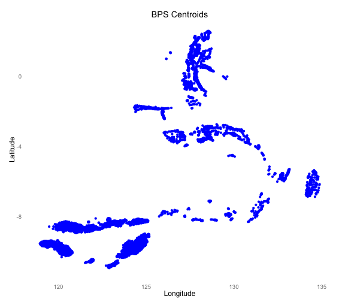

# Prepare Indonesia Data for NetworkPlanner Simulations
========================================================

This is the process Earth Insitute researchers have used to prepare national Indonesian datasets for modeling NetworkPlanner, a tool in our Planning Development Toolkit: <http://networkplanner.modilabs.org/>

This document outlines the 'last mile' steps utilized to consolidate datasets from
* [1] Badan Pusat Statistik (BPS) - the central agency on statistics
* [2] Badan Informasi Geospasial (BIG) - the national geospatial agency
* [3] Perusahaan Listrik Negara (PLN) - the state electricity company 


Load Libraries 

```r

require(maptools)
require(plyr)
require(stringr)
require(ggplot2)
library(knitr)

source("~/github/network-planner//IDN-analysis//Preprocessing/DataMungingFunctions.R")
```


# INPUTS

## I. Import Centroid shapefiles - BPS Provided 
Jonathan developed a shapefiles of centroids for each and every Desa (Village) in our Indonesia project area.  We import that information to in case there is an absence of better location data.  


```r
setwd('~/github/network-planner/IDN-analysis/Preprocessing/')

NTT_Centroids <- readShapePoints("Shapefiles/NTT_centroids_20140205.shp")
NTT_Centroids <- as.data.frame(NTT_Centroids) 
#Renames 'EI_Subarea' variable name in NTT to agree with other Provinces
NTT_Centroids <- rename(NTT_Centroids, replace=c("EI_subarea"="EI_SubArea"))

Maluku_Centroids <- readShapePoints("Shapefiles/Maluku-Desa_centroids.shp")
MalukuUtara_Centroids <- readShapePoints("Shapefiles/Maluku_Utara-Desa_centroids.shp")

#Combine all shapefiles of centroids into single dataframe 
all_centroids <- rbind.fill(as.data.frame(NTT_Centroids),
                            as.data.frame(Maluku_Centroids),
                            as.data.frame(MalukuUtara_Centroids))

#rename lat, long columns to better agree with NP nomenclature
all_centroids <- rename(all_centroids, replace=c("coords.x1"="Longitude",
                                                 "coords.x2"="Latitude"))

#establish a unique cluster code for Desa centroid locations for faster indexing
all_centroids$Clust_Code <- str_c(all_centroids$IDSP2010,"99")
all_centroids$Name <- all_centroids$Clust_Code
#Establish X,Y Data Source Variable to track origin of data 
all_centroids$XY_Source <- "BPS_Centroids"

###DATA DIRTY
#integrity issue with Centroids file is resolved here
#certain desas are composed of multi-polygons and therefore have multiple observations reported
#specifically, the following desas have repeat, non-unqiue, centroid observations.  
Repeat_Desas = c(530901001299,
                 810602002199, 
                 820306200199, 
                 820402200299, 
                 820506000199)

multiple_centroid_desas <- all_centroids[which(all_centroids$Clust_Code %in% Repeat_Desas),]

#use loop to select first occurence of each repeat Desa centroid in 'consolidate_multiples' df
consolidate_multiples <- as.data.frame(NULL)
for (i in 1:length(Repeat_Desas)){
  first_of_repeats <- all_centroids[which(all_centroids$Clust_Code == Repeat_Desas[i]),][1,]
  consolidate_multiples <- rbind.fill(consolidate_multiples,
                                      first_of_repeats)
  }
##omit the the repeats for now because they're causing complications and I dont know which single one to select to include
all_centroids <- all_centroids[which(!(all_centroids$Clust_Code %in% multiple_centroid_desas$Clust_Code)),]
#now add back in only the first of each repeated Desa Centroid 
all_centroids <- rbind.fill(all_centroids,
                            consolidate_multiples)


#seperate out the cluster location w and without hhold size
centroids_w_hosize <- (all_centroids[((all_centroids$NUM_HHOLDS)!=0),])
centroids_wout_hosize <- (all_centroids[((all_centroids$NUM_HHOLDS)==0),])
#use average of all clusters' household size for the missing instances
centroids_wout_hosize$NUM_HHOLDS <- mean(all_centroids$NUM_HHOLDS, na.rm=T)
#now redefine cluster dataframe such that all observations have a ho_size defined
all_centroids <- rbind(centroids_w_hosize, centroids_wout_hosize)


###DATA Cleaned

#Name column for unique cluster code for faster indexing
row.names(all_centroids) <- all_centroids$Clust_Code
#Preview Dataframe structure
head(all_centroids, n=1L)
```

```
##                         PROVINSI   KECAMATAN        DESA PROVNO KABKOTNO
## 537104001199 NUSA TENGGARA TIMUR KELAPA LIMA KELAPA LIMA     53       71
##              KECNO DESANO   IDSP2010      KABKOT                SUMBER
## 537104001199   040    011 5371040011 KOTA KUPANG BADAN PUSAT STATISTIK
##               id_kec POLY VILLAGE_CO KODE_PROV           NAMA_PROV
## 537104001199 5371040 POLY 5371040011        53 NUSA TENGGARA TIMUR
##              KODE_KAB NAMA_KAB KODE_KEC    NAMA_KEC KODE_DESA   NAMA_DESA
## 537104001199       71   KUPANG       40 KELAPA LIMA        11 KELAPA LIMA
##              R401A R401B R401C R501A R501B PLN_HHOLD JOIN_FIELD population
## 537104001199  6842  6995  3544  3367   177    0.9501 -214748364      13837
##              NUM_HHOLDS NUM_PLN PCT_PLN WITHOUT_PL EI_SubArea Longitude
## 537104001199       3534    3466  0.9808         68 Area Kupan     123.6
##              Latitude IDSP PLN_Cabang   Clust_Code         Name
## 537104001199   -10.15   NA       <NA> 537104001199 537104001199
##                  XY_Source
## 537104001199 BPS_Centroids
```

```r

#Establish PLN_Cabang variable
missing_PLN_Cabanag <- subset(all_centroids[which(is.na(all_centroids$PLN_Cabang)),])
missing_PLN_Cabanag$PLN_Cabang <- missing_PLN_Cabanag$EI_SubArea

has_PLN_Cabanag <- subset(all_centroids[which(!(is.na(all_centroids$PLN_Cabang))),])

all_centroids <- rbind(has_PLN_Cabanag, missing_PLN_Cabanag)


#Also establish a blank_theme template from Prabhas' recommendations 
blank_theme <- function() {
  theme(#axis.text=element_blank(), axis.title=element_blank(), 
        axis.ticks=element_blank(),
        panel.grid=element_blank(),
        panel.background=element_blank())
  }


google_earth_plot <- function(points) {
  
  ##This returns the left/bottom/right/top bounding box points 
  #of a given X, Y point set
  #names(location) <- c("left","bottom","right","top")
  loc <- c(min(points$Longitude), #left 
           min(points$Latitude), #bottom
           max(points$Longitude), #right
           max(points$Latitude)) #top
  map <- get_map(location= loc)
  
  p <- ggmap(map, legend = "topleft") + 
             geom_point(data=points, aes(x = Longitude, y = Latitude), colour = 'blue') +
             coord_equal()
  
  return(p)
  }

#Output plot of All Centroids
ggplot(all_centroids, aes(x = Longitude, y = Latitude))+ 
  geom_point(colour = 'blue') + 
  labs(title = "BPS Centroids") + 
  coord_equal() +
  blank_theme()
```

 

```r

google_earth_plot(all_centroids)
```

```
## Error: could not find function "get_map"
```


## II. Settlemnt Areas via Landuse Maps - BIG

Shaky's geospatial analysis reduces BIG landuse maps to cluster points from BIG-identified settlement areas.  This is the preferred dataset for determining village cluster locations so I incorporate it here.  However this alone is not adequate since not all Desas are represented even with more of Shaky's cleanup efforts. There are simply intermittent gaps in BIG coverage.   


```r
# original processed BIG data had some gaps but was usable after some
# massaging included (1)Unique Cluster Code & (2) Some designated geographic
# areas, big file w/ ~17,000 observations!  cluster_points <-
# read.csv('~/Dropbox/Indonesia Geospatial Analysis/Data Modeling and
# Analysis/NPinputs/Jan2014-Preprocessing/cluster_points_NTT+MMU-updated20140109+Clust_Code.csv',
# header = T)

# Updated January 14.  Shaky identified projection issue with original
# lat/long points which is now resolved
cluster_points <- read.csv("~/Dropbox/Indonesia Geospatial Analysis/Data Modeling and Analysis/NPinputs/Jan2014-Preprocessing/ShakyUpdata-20140114/all_big_settlement_points_with_pop_01142014_corrected+Clust_Code.csv", 
    header = T)

## Areas in NTT do not have PLN_Cabang office areas defined.  Instead only an
## EI_SubArea is defined In those cases, use the EI_SubArea values for the
## PLN_Cabang variable value
cluster_points$PLN_Cabang <- as.character(cluster_points$PLN_Cabang)  #addressing the factor problem
cluster_points$EI_SubArea <- as.character(cluster_points$EI_SubArea)  #addressing the factor problem
cluster_points <- fill_PLN_Cabang(cluster_points)
cluster_points$PLN_Cabang <- as.factor(cluster_points$PLN_Cabang)

## use unique Clust_Code field for cluster_points to give each obs a unique
## ID with IDSP no. as prefix
row.names(cluster_points) <- cluster_points$Clust_Code

# sample output for your to get a sense of data structure
head(cluster_points, n = 1L)
```

```
##               FID OBJECTID Join_Count TARGET_FID KODE_UNSUR TOPONIM
## 530102100601 9486        1          1          1      50102        
##                              PELAKSANA  UPDATE_ F_AREA UPDATED ORIG_FID
## 530102100601 INDAH UNGGUL BERSAMA, PT. 20070510   9234      NA        0
##                         PROVINSI KECAMATAN         DESA PROVNO KABKOTNO
## 530102100601 NUSA TENGGARA TIMUR   LAMBOYA PATIALA BAWA     53        1
##              KECNO DESANO  IDSP2010      KABKOT                SUMBER
## 530102100601    21      6 5.301e+09 SUMBA BARAT BADAN PUSAT STATISTIK
##               id_kec POLY IDSP VILLAGE_CO KODE_PROV           NAMA_PROV
## 530102100601 5301021 POLY    0  5.301e+09        53 NUSA TENGGARA TIMUR
##              KODE_KAB    NAMA_KAB KODE_KEC NAMA_KEC KODE_DESA    NAMA_DESA
## 530102100601        1 SUMBA BARAT       21  LAMBOYA         6 PATIALA BAWA
##              R401A R401B R401C R501A R501B PLN_HHOLD NO_PLN AREA_KM2
## 530102100601  1122  1054   567     0    25         0    567    4.374
##              TOT_POP TOT_HHOLD POP_DEN HHOLD_DEN     MID PLN_GRID       X
## 530102100601    2176       567   497.5     129.6 0.08783        0 -565359
##                    Y CLUSTRATIO CLUSTPOP Longitude Latitude CLUSTAREA
## 530102100601 8906155     0.2427      528     119.3   -9.757  0.009234
##              Sum_CLUSTA Clust_Code EI_SubArea PLN_Cabang
## 530102100601    0.03804  5.301e+11  AreaSumba  AreaSumba
```

```r

# Establish X,Y Data Source Column
cluster_points$XY_Source <- "BIG_Settlements"
# Establish other key NP parameters
cluster_points$ho_size <- cluster_points$TOT_POP/cluster_points$TOT_HHOLD
cluster_points$pop <- cluster_points$CLUSTPOP
cluster_points$Name <- cluster_points$Clust_Code
cluster_points$population <- cluster_points$pop

# seperate out the cluster location w and without hhold size
clusters_w_hosize <- (cluster_points[!(is.na(cluster_points$ho_size)), ])
clusters_wout_hosize <- (cluster_points[(is.na(cluster_points$ho_size)), ])
# use average of all clusters' household size for the missing instances
clusters_wout_hosize$ho_size <- mean(cluster_points$ho_size, na.rm = T)
```

```
## Error: replacement has 1 row, data has 0
```

```r
# now redefine cluster dataframe such that all observations have a ho_size
# defined
cluster_points <- rbind(clusters_w_hosize, clusters_wout_hosize)


ggplot(cluster_points, aes(x = Longitude, y = Latitude)) + geom_point(colour = "red") + 
    labs(title = "BIG Settlement Location") + coord_equal()
```

 


## III. Import 2010 Census Data - BPS
This serves a definitive reference for ALL desas that are within our project area.

```r

NTT_Census <- read.csv("~/Dropbox/Indonesia Geospatial Analysis/Data Modeling and Analysis/BPS/BPS_Processing/NTT_with_Census_Data.csv")
Maluku_Census <- read.csv("~/Dropbox/Indonesia Geospatial Analysis/Data Modeling and Analysis/BPS/BPS_Processing/Maluku_with_Census_Data.csv")
MalukuUtara_Census <- read.csv("~/Dropbox/Indonesia Geospatial Analysis/Data Modeling and Analysis/BPS/BPS_Processing/Maluku_Utara_with_Census_Data.csv")

census_all <- rbind.fill(NTT_Census, Maluku_Census, MalukuUtara_Census)

head(census_all, n = 1L)
```

```
##              PROVINSI   KECAMATAN        DESA PROVNO KABKOTNO KECNO DESANO
## 1 NUSA TENGGARA TIMUR KELAPA LIMA KELAPA LIMA     53       71    40     11
##    IDSP2010      KABKOT                SUMBER  id_kec POLY VILLAGE_CO
## 1 5.371e+09 KOTA KUPANG BADAN PUSAT STATISTIK 5371040 POLY  5.371e+09
##   KODE_PROV           NAMA_PROV KODE_KAB NAMA_KAB KODE_KEC    NAMA_KEC
## 1        53 NUSA TENGGARA TIMUR       71   KUPANG       40 KELAPA LIMA
##   KODE_DESA   NAMA_DESA R401A R401B R401C R501A R501B PLN_HHOLD JOIN_FIELD
## 1        11 KELAPA LIMA  6842  6995  3544  3367   177    0.9501 -2.147e+09
##   population NUM_HHOLDS NUM_PLN PCT_PLN IDSP
## 1      13837       3534    3466  0.9808   NA
```


# Form Composite View of Settled Areas

Here, we identify where there are gaps within the BIG land use maps identifying settlement areas.  We then ensure the Desas are represented with a centroid of their administrative boundary instead of being left out of the considered analysis altogether.


```r
# 1. Determine which Desas have cluster locations specified & where are the
# gaps?
desas_with_BIG_data <- unique(cluster_points$IDSP2010)

# BPS list of all Desas in project area, defintiive list of all Desas
desa_list <- (unique(census_all$IDSP2010))

# We identify all Desas for whcih BIG does not identify 'Settlement' areas
desa_gaps <- setdiff(desa_list, desas_with_BIG_data)

# 3.1 Of gaps in cluster locations, apply 100% of census data to that
# location Determine which census columns to carryover from census to
# cluster points cluster_column_names <-
# colnames(cluster_points)[which(colnames(cluster_points) %in%
# colnames(census_all))]
cluster_column_namesV2 <- colnames(cluster_points)[which(colnames(cluster_points) %in% 
    colnames(all_centroids))]


# Develop dataframe that will fill Desa cluster gaps from the census file
desa_gap_fillers <- subset(all_centroids, IDSP2010 %in% desa_gaps, c(cluster_column_namesV2, 
    "population", "NUM_HHOLDS"))

# population is not further subdivided for desas without cluster information
desa_gap_fillers$CLUST_POP <- desa_gap_fillers$population
desa_gap_fillers$DESA_POP <- desa_gap_fillers$population
desa_gap_fillers$pop <- desa_gap_fillers$population
# preserve household size information at the per desa level
desa_gap_fillers$ho_size <- desa_gap_fillers$DESA_POP/desa_gap_fillers$NUM_HHOLDS

# 3.2 Denote gap areas with special Cluster ID of XXX-99
desa_gap_fillers <- unique(desa_gap_fillers)  #getting read of duplicate value
row.names(desa_gap_fillers) <- desa_gap_fillers$Clust_Code

# 3.3 Assign Centroids as X,Y for Desas with cluster info gaps

desa_gap_fillers$XY_Source <- "BPS_Centroids"

# this is not needed, info carried through now...  for (i in
# 1:nrow(desa_gap_fillers)) { #assign the corresponding Lat,Long values
# cluster_code <- desa_gap_fillers[i, 'Clust_Code'] desa_gap_fillers[i,
# 'Longitude'] <- all_centroids[cluster_code, 'Longitude']
# desa_gap_fillers[i, 'Latitude'] <- all_centroids[cluster_code, 'Latitude']
# desa_gap_fillers[i, 'EI_SubArea'] <-
# as.character(all_centroids[cluster_code, 'EI_SubArea']) }

# Address the factor vs. character problem as we prepare for merge,
desa_gap_fillers$PLN_Cabang <- as.character(desa_gap_fillers$PLN_Cabang)  #addressing the factor problem
desa_gap_fillers$EI_SubArea <- as.character(desa_gap_fillers$EI_SubArea)  #addressing the factor problem

# now merge two existing datasets
composite_settlements <- rbind.fill(cluster_points, desa_gap_fillers)
```

```
## Error: could not find function "rbind.fill"
```

```r
# Get rid of some redundancy
composite_settlements$X <- NULL
```

```
## Error: object 'composite_settlements' not found
```

```r
composite_settlements$Y <- NULL
```

```
## Error: object 'composite_settlements' not found
```

```r

# target household penetration rate needs to be considered
composite_settlements[which(is.na(composite_settlements$TOT_HHOLD)), "TOT_HHOLD"] <- composite_settlements[which(is.na(composite_settlements$TOT_HHOLD)), 
    "NUM_HHOLDS"]
```

```
## Error: object 'composite_settlements' not found
```

```r
composite_settlements <- mutate(composite_settlements, target_household_penetration_rate = (1 - 
    PLN_HHOLD))
```

```
## Error: could not find function "mutate"
```

```r

# Deraste the population by the target penetration factor
composite_settlements$pop <- composite_settlements$pop * composite_settlements$target_household_penetration_rate
```

```
## Error: object 'composite_settlements' not found
```

```r
composite_settlements$full_population <- composite_settlements$population
```

```
## Error: object 'composite_settlements' not found
```

```r
composite_settlements$population <- NULL
```

```
## Error: object 'composite_settlements' not found
```

```r

ggplot(composite_settlements, aes(x = Longitude, y = Latitude)) + geom_point(aes(colour = XY_Source)) + 
    labs(title = "Composite View of Settlement Locations")
```

```
## Error: could not find function "ggplot"
```

```r
table(composite_settlements$XY_Source)
```

```
## Error: object 'composite_settlements' not found
```

```r

# Visual check on geogpraphic divisions
ggplot(composite_settlements, aes(x = Longitude, y = Latitude)) + geom_point(aes(colour = EI_SubArea)) + 
    labs(title = "Geographic Divsions of Settlement Locations")
```

```
## Error: could not find function "ggplot"
```

```r
# Visual check on PLN Area Territories
summary(composite_settlements$EI_SubArea)
```

```
## Error: object 'composite_settlements' not found
```

```r

ggplot(composite_settlements, aes(x = Longitude, y = Latitude)) + geom_point(aes(colour = PLN_Cabang)) + 
    labs(title = "PLN Area Offices") + coord_equal()
```

```
## Error: could not find function "ggplot"
```

```r

table(composite_settlements$PLN_Cabang)
```

```
## Error: object 'composite_settlements' not found
```


# Output Composite Demographic Files by Region

Based on the granularity demanded to run electrification scenarios, we output a few breakdown of demographic files.  These csv collectively represent the entire project area population along with approximate locations (determined to the best of our ability) and key attribute data.  The files are made in decreasing order of granularity. 


```r
# #minimize variables passed through to bare neccessities
df <- subset(composite_settlements, select = c("Name", "Latitude", "Longitude", 
    "pop", "ho_size", "EI_SubArea", "PLN_Cabang", "PROVINSI", "XY_Source", "target_household_penetration_rate", 
    "full_population"))
```

```
## Error: object 'composite_settlements' not found
```

```r
composite_settlements <- df
# #Output entire field write.csv(composite_settlements, '~/Dropbox/Indonesia
# Geospatial Analysis/Data Modeling and
# Analysis/NPinputs/Jan2014-Preprocessing/CompositeDemographicFile.csv',
# row.names=F) Output Geographic Area Division
Regions <- unique(composite_settlements$EI_SubArea)
```

```
## Error: object of type 'closure' is not subsettable
```

```r
setwd("~/Dropbox/Indonesia Geospatial Analysis/Data Modeling and Analysis/NPinputs/Feb2014-Preprocessing/DemographicInputs-GeographicDivisions//")
for (i in 1:length(Regions)) {
    subset_area <- subset(composite_settlements, EI_SubArea == Regions[i])
    write.csv(subset_area, str_c(Regions[i], "-demographic_data_with_centroids_for_gaps-20140206.csv"), 
        row.names = F)
}
```

```
## Error: object 'Regions' not found
```

```r
# flores <- c('FloresTimu', 'FloresBara') flores_subset <-
# subset(composite_settlements, EI_SubArea %in% flores)
# write.csv(flores_subset,
# 'Flores-demographic_data_with_centroids_for_gaps-20140206.csv', row.names
# = F)

# Output less granular subset
setwd("~/Dropbox/Indonesia Geospatial Analysis/Data Modeling and Analysis/NPinputs/Feb2014-Preprocessing/DemographicInputs-PLN_Cabang/")
cabangs <- unique(composite_settlements$PLN_Cabang)
```

```
## Error: object of type 'closure' is not subsettable
```

```r
for (i in 1:length(cabangs)) {
    subset_area <- subset(composite_settlements, PLN_Cabang == cabangs[i])
    write.csv(subset_area, str_c(cabangs[i], "-demographic_data_with_centroids_for_gaps-20140206.csv"), 
        row.names = F)
}
```

```
## Error: object 'cabangs' not found
```

```r


# If we wanted division by Provinces
setwd("~/Dropbox/Indonesia Geospatial Analysis/Data Modeling and Analysis/NPinputs/Feb2014-Preprocessing/DemographicInputs-Province/")
NTT <- subset(composite_settlements, PROVINSI == "NUSA TENGGARA TIMUR")
```

```
## Error: object 'PROVINSI' not found
```

```r
write.csv(NTT, "NTT-demographic_data_with_centroids_for_gaps.csv", row.names = F)
```

```
## Error: object 'NTT' not found
```

```r

Maluku <- subset(composite_settlements, PROVINSI == "MALUKU")
```

```
## Error: object 'PROVINSI' not found
```

```r
write.csv(Maluku, "Maluku-demographic_data_with_centroids_for_gaps.csv", row.names = F)
```

```
## Error: object 'Maluku' not found
```

```r

MalukuUtara <- subset(composite_settlements, PROVINSI == "MALUKU UTARA")
```

```
## Error: object 'PROVINSI' not found
```

```r
write.csv(MalukuUtara, "MalukuUtara-demographic_data_with_centroids_for_gaps.csv", 
    row.names = F)
```

```
## Error: object 'MalukuUtara' not found
```

